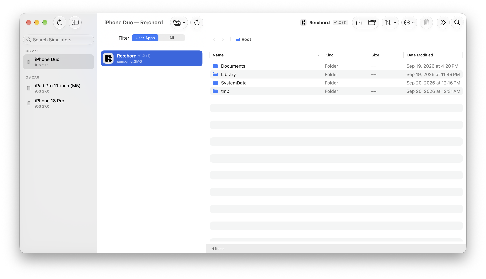

# Simfiles

[English](README.md) | [한국어](README.ko.md)

> A native macOS utility for inspecting Apple platform simulator lifecycles and managing application sandbox file systems (`Documents`, `Library`, `tmp`, etc.) in real time.

[](https://www.apple.com/macos/)
[](https://swift.org)
[](https://developer.apple.com/xcode/)
[](https://github.com/lemnlabs/homebrew-tap)
[](LICENSE)
[](https://github.com/lemnlabs/Simfiles)

---

## Preview

<p align="center">
    
</p>

---

## Features

### Simulator Device Management
- **Unified Device Discovery**: Automatically detects installed simulators across iOS, iPadOS, watchOS, tvOS, and visionOS, grouped by OS runtime version.
- **Lifecycle Control**: Boot, shut down, filter active simulators, and launch the native `Simulator.app` directly from the sidebar.
- **Media Asset Injection**: Add photos and videos to simulator photo libraries (`xcrun simctl addmedia`) with a single click.
- **Quick Path & Identifier Access**: Copy simulator UDIDs, jump to device data directories in Finder, or reveal simulator media folders.

### Installed Application Inspection
- **App Listing & Filtering**: Browse installed applications with instant filtering between user-installed and pre-installed system apps, plus real-time search by display name or bundle identifier.
- **Process Monitoring & Execution**: Observe running app status and launch or terminate app processes on booted simulators with one click.
- **Container Quick-Access**: Reveal `.app` application bundles and app data container folders directly in Finder.

### Sandbox File Browser
- **Standard Sandbox Navigation**: Seamlessly switch between standard application container directories: `Documents`, `Library`, `tmp`, and `Root`.
- **Finder-Style Table View**: Sort files by Name, Kind, Size, and Date Modified, with an option to keep folders pinned to the top.
- **Drag-and-Drop Import**: Drag files and folders directly from macOS Finder into the app window to import them into the sandbox.
- **Complete File Operations**: Create folders, rename, copy, cut, paste, and safely move files to the macOS Trash.
- **Quick Look & Tool Integration**: Inspect file contents with Quick Look (`Space`), open folders in macOS Terminal, or reveal items in Finder.
- **Live Filesystem Synchronization**: Real-time directory monitoring (`DispatchSource`) instantly updates the browser view whenever files change inside or outside the app.

---

## Requirements

### End User Requirements
- **Operating System**: macOS 15.0 (Sequoia) or later
- **Architecture**: Apple Silicon (M1/M2/M3/M4) or Intel Mac (Universal binary)
- **Dependencies**: Xcode 16.0 or later with Command Line Tools installed (`xcrun simctl`)

### Developer Requirements
- **Xcode**: Xcode 16.0 or later
- **Swift**: Swift 6.0 toolchain (`SWIFT_DEFAULT_ACTOR_ISOLATION = MainActor`)
- **Code Quality**: `swift-format` (for linting and formatting)

---

## Installation

### Option 1: Homebrew Cask (Recommended)
Install directly via the [lemnlabs/homebrew-tap](https://github.com/lemnlabs/homebrew-tap) repository:

```bash
brew install --cask lemnlabs/tap/simfiles
```

To update to the latest version in the future:
```bash
brew upgrade --cask simfiles
```

### Option 2: GitHub Releases (Direct Download)
1. Download the latest `Simfiles.dmg` or `Simfiles.zip` from [GitHub Releases](https://github.com/lemnlabs/Simfiles/releases).
2. Drag `Simfiles.app` into your `/Applications` folder.

> [!IMPORTANT]
> Open-source development builds may not be signed or notarized with an Apple Developer certificate. If macOS Gatekeeper displays a security notice on first launch:
> 1. Open **System Settings > Privacy & Security**.
> 2. Scroll down to the **Security** section and click **Open Anyway**.
> *(Bypassing Gatekeeper using arbitrary terminal commands like `xattr -cr` is not recommended.)*

### Option 3: Build from Source
Clone the repository and compile a Release build locally:

```bash
# 1. Clone the repository
git clone https://github.com/lemnlabs/Simfiles.git
cd Simfiles

# 2. Build Release configuration
xcodebuild build -scheme Simfiles -destination 'platform=macOS' -configuration Release CODE_SIGNING_ALLOWED=NO CODE_SIGNING_REQUIRED=NO

# 3. Copy the compiled app to Applications
cp -R ~/Library/Developer/Xcode/DerivedData/Simfiles-*/Build/Products/Release/Simfiles.app /Applications/
```

---

## Usage

1. **Select a Simulator**: Choose a simulator from the left sidebar. If it is powered off, click the boot action button.
2. **Select an Application**: Pick an installed app from the middle panel. Use the segmented picker to filter by user apps or search by bundle ID.
3. **Inspect Sandbox Files**: Browse through `Documents`, `Library`, or `tmp` directories in the right-hand file browser.
4. **Import & Manipulate Files**: Drag and drop files from Finder into the detail view, or use toolbar actions to create folders, preview with Quick Look, or reveal items in Finder.

### Keyboard Shortcuts
| Shortcut | Action |
| :--- | :--- |
| `Space` | Toggle Quick Look preview on selected file |
| `Cmd + [` | Go back to previous folder |
| `Cmd + ]` | Go forward to next folder |
| `Cmd + Up` | Navigate to parent directory |
| `Delete` or `Cmd + Backspace` | Move selected items to Trash (with confirmation) |

---

## Privacy & Permissions

### 100% Local Processing (Zero Telemetry, No Network)
- Simfiles performs **zero network requests**.
- There is no telemetry, analytics, tracking, or external server communication. All file operations and simulator interactions occur strictly on your local machine.

### App Sandbox Disabled (Non-Sandboxed Utility)
- Simfiles directly accesses CoreSimulator container paths located at `~/Library/Developer/CoreSimulator/Devices/` and executes `xcrun simctl` commands.
- Under macOS App Sandbox rules, arbitrary filesystem access outside standard user containers and sub-process execution are strictly blocked. Therefore, App Sandbox is intentionally disabled (`ENABLE_APP_SANDBOX = NO`).

### System Permissions & CLI Utilities
- **Filesystem Access**: Read, write, and delete permissions within local CoreSimulator device directories.
- **`xcrun simctl`**: Used locally to query simulator metadata, boot/shutdown devices, and inject media assets.

---

## Development

Clone the repository and verify the build with the following commands:

```bash
# 1. Clone the repository
git clone https://github.com/lemnlabs/Simfiles.git
cd Simfiles

# 2. Open in Xcode
open Simfiles.xcodeproj

# 3. Verify build via CLI
xcodebuild build -scheme Simfiles -destination 'platform=macOS' CODE_SIGNING_ALLOWED=NO CODE_SIGNING_REQUIRED=NO

# 4. Run style linting and auto-formatting
swift format lint -r Simfiles
swift format format -i -r Simfiles
```

- **Architecture Details**: Review the MVVM layer design and Swift 6 concurrency patterns in [docs/ARCHITECTURE.md](docs/ARCHITECTURE.md).
- **Development Guide**: See [docs/DEVELOPMENT.md](docs/DEVELOPMENT.md) for environment details and Xcode 16 synchronization tips.

---

## Contributing

Contributions, bug reports, and feature requests are warmly welcomed! Please read [CONTRIBUTING.md](CONTRIBUTING.md) for guidelines on pull requests and commit conventions.

---

## License

This project is licensed under the [MIT License](LICENSE).
